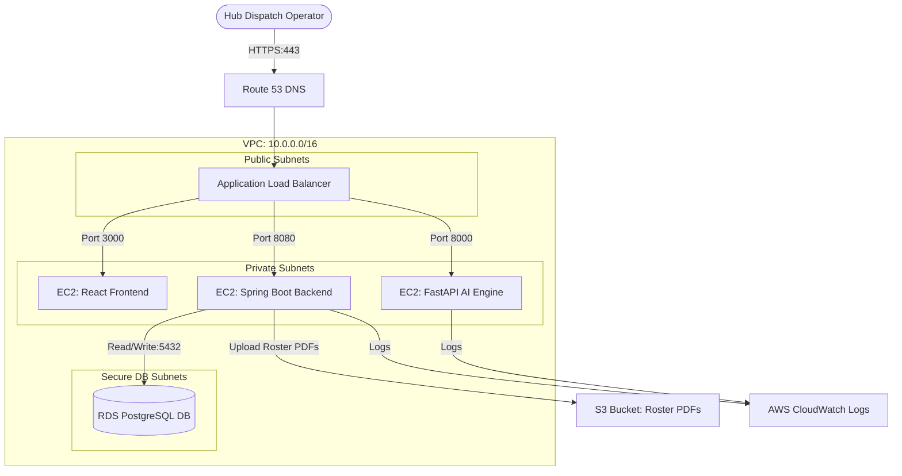

# AWS Production Architecture Deployment Guide

This document details the configuration and manual/automated steps required to deploy the **AI Powered Flight Crew Dispatch Coordinator** application in a secure, highly available, and scalable environment on AWS.

## Architecture Topology



---

## 1. VPC & Network Architecture Setup

1. **VPC Allocation**:
   - Create a VPC with CIDR block `10.0.0.0/16` named `skycrew-production-vpc`.
2. **Subnet Sub-division**:
   - **Public Subnet A** (`10.0.1.0/24`) & **Public Subnet B** (`10.0.2.0/24`) for Load Balancers.
   - **Private Subnet A** (`10.0.10.0/24`) & **Private Subnet B** (`10.0.11.0/24`) for EC2 Web/Application instances.
   - **DB Private Subnet A** (`10.0.20.0/24`) & **DB Private Subnet B** (`10.0.21.0/24`) for RDS.
3. **Gateway Allocations**:
   - Provision an **Internet Gateway (IGW)** and attach to `skycrew-production-vpc`.
   - Allocate an **Elastic IP** and launch a **NAT Gateway** inside `Public Subnet A` so private subnets can route downloads out securely.

---

## 2. AWS Security Groups (Least Privilege Configuration)

Create three specific Security Groups:

| Security Group Name | Inbound Rules | Outbound Rules |
| :--- | :--- | :--- |
| `skycrew-alb-sg` | Allow HTTP (80) & HTTPS (443) from `0.0.0.0/0` | Port 80, 8080, 8000 to `skycrew-ec2-sg` |
| `skycrew-ec2-sg` | Allow 80 (Frontend), 8080 (Backend), 8000 (AI) from `skycrew-alb-sg`; SSH (22) from Bastion Host / VPN IP | Any outbound |
| `skycrew-rds-sg` | Allow PostgreSQL (5432) from `skycrew-ec2-sg` | None |

---

## 3. AWS RDS PostgreSQL Setup

1. Launch an **Amazon RDS PostgreSQL** instance:
   - **DB Engine**: PostgreSQL 15.x
   - **Deployment**: Multi-AZ (production high availability)
   - **Instance Class**: `db.t3.medium`
   - **VPC Subnet Group**: Assign `DB Private Subnet A` and `B`.
   - **Public Access**: Select **No**.
   - **Security Group**: Assign `skycrew-rds-sg`.
2. **Database Credentials**:
   - Database name: `skycrewdb`
   - Master user: `postgres`
   - Store credentials in **AWS Secrets Manager**.

---

## 4. AWS S3 Storage for Crew Rosters

1. Create a private S3 bucket named `skycrew-rosters-reports`.
2. **Bucket Policies**: Disable public read/write permissions. Enable Server-side Encryption (SSE-S3).
3. **IAM Service Role**:
   Create an IAM Role `skycrew-ec2-role` and assign the following policy statement for S3 interaction:

```json
{
  "Version": "2012-10-17",
  "Statement": [
    {
      "Effect": "Allow",
      "Action": [
        "s3:PutObject",
        "s3:GetObject",
        "s3:ListBucket"
      ],
      "Resource": [
        "arn:aws:s3:::skycrew-rosters-reports",
        "arn:aws:s3:::skycrew-rosters-reports/*"
      ]
    }
  ]
}
```

Attach this IAM Role to the EC2 instances.

---

## 5. EC2 Provisioning & Docker Deployment

1. Launch an EC2 Instance (`t3.medium`) inside `Private Subnet A`. Assign the IAM Instance Profile containing `skycrew-ec2-role`.
2. Allocate an **Elastic IP** and assign it to the EC2 instance or ALB gateway.
3. Install the Docker Engine on Amazon Linux 2 / Ubuntu:

```bash
# Update local packages
sudo apt-get update -y
# Install Docker
sudo apt-get install docker.io -y
# Install Docker Compose
sudo curl -L "https://github.com/docker/compose/releases/download/v2.18.1/docker-compose-$(uname -s)-$(uname -m)" -o /usr/local/bin/docker-compose
sudo chmod +x /usr/local/bin/docker-compose
# Start Docker Service
sudo systemctl start docker
sudo systemctl enable docker
```

4. Clone the repository codebase, set up an environment file `.env` with production variables:

```env
OPENAI_API_KEY=your_production_openai_api_key
SPRING_DATASOURCE_URL=jdbc:postgresql://skycrew-rds-instance.cr123456789.us-east-1.rds.amazonaws.com:5432/skycrewdb
SPRING_DATASOURCE_USERNAME=postgres
SPRING_DATASOURCE_PASSWORD=your_secrets_manager_db_pwd
```

5. Launch the production containers:

```bash
docker-compose -f docker-compose.yml up --build -d
```

---

## 6. CloudWatch Logging Integration

1. Install the CloudWatch Unified Agent on the EC2 instances to monitor resource health metrics.
2. In the Docker compose setup, configure log rotation limits to prevent partition saturation:

```yaml
logging:
  driver: "json-file"
  options:
    max-size: "50m"
    max-file: "5"
```
3. Establish metric filter alarms in CloudWatch for server memory saturation or CPU load spikes to trigger SNS paging alerts.
